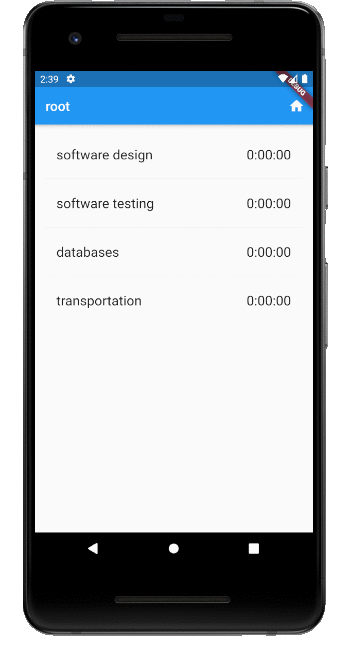
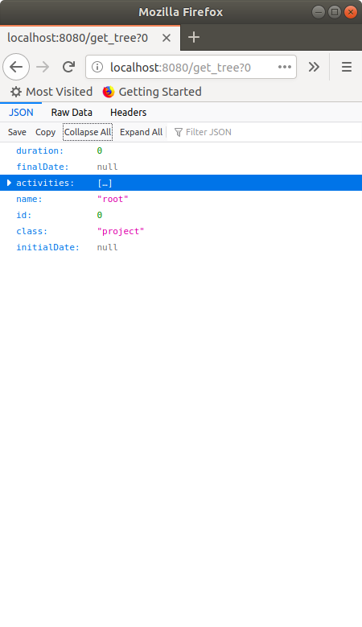
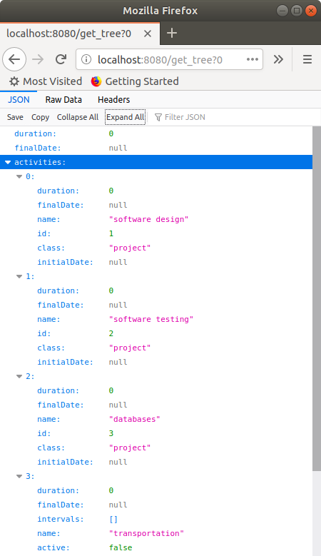

<!--
author: Joan Serrat
summary: Time Tracker app in Flutter
id: timetracker-in-flutter
tags: Flutter, Dart, JSON
categories: codelab,markdown
environments: Web
status: Published
feedback link: cv.uab.es
analytics account:
-->

# Tutorial TimeTracker App

<!-- ## Introduction -->
<!-- Duration: 0:02:00 -->

This tutorial has two goals:
- learn how to make a simple user interface in Flutter
- build the base of the time tracker app that you have to do for the practicum

A base means that some parts of the code you'll probably want to keep them, but others related to the user interface appearance, will definitely to be changed.

This is what we are going to build:



What this animation shows is :
- two types of screens, one for projects and tasks, another for intervals
- navigation down and up plus a go home button
- long press on a task item starts/stops its timer, creating a new interval
- periodic uptade of the interface every 6 seconds, that is, the app requests the webserver to update what it shows
- likewise, navigation up and down, go home, start and stop send requests also to the server

Preconditions:
- you have installed Flutter into IntelliJ. If not, see how to in the practicum handout
- you have read the slides on Dart and Fluttet
- same with the slides on Flutter "futures"
- optionally you have also gone through the getting started codelab in [flutter.dev](http://flutter.dev)


Outline:

1. [A view with a static list](#1-a-view-with-a-static-list)

    1.1. [Create the data to show](#11-create-the-data-to-show)

    1.2 [Create the view to show the data](#12-create-the-view-to-show-the-data)

1. [Connecting views](#2-connecting-views)
1. [Implement the Java webserver](#3-implement-the-java-webserver)
1. [Connect the Flutter app to the Java webserver](#4-connect-the-flutter-app-to-the-java-webserver)
1. [Home button](#5-home-button)
1. [Count the time](#6-count-the-time)
1. [Automatic refresh](#7-automatic-refresh)
1. [Format date and time](#8-format-date-and-time)

---

# 1. A view with a static list
<!-- Duration: 0:03:00 -->

First step is to create Dart classes to represent the one-level tree that is shown in both the task/projects screen or the intervals screen. In the first case the root is a project, in the second is a task. A Flutter object to display a screen of projects and tasks will get the data to show from this tree. For the moment we will instantiate a fixed fake tree. Later on, the tree will be the answer to a REST query to the webserver.

<br>

## 1.1 Create the data to show

<br>

**1.** Launch IntelliJ and create a new Flutter project named `codelab_timetracker`. Let the wizard create the `lib/main.dart` file for you.

**2.** Edit `pubspec.yaml` to add a dependency to the intl Dart library. It will allow us to format dates and times.

```yaml
dependencies:
  intl: ^0.17.0
  flutter:
    sdk: flutter
```

**3.** Add a new Dart file to the lib folder named `tree.dart` with the following content:


```dart
// see Serializing JSON inside model classes in
// https://flutter.dev/docs/development/data-and-backend/json

import 'package:intl/intl.dart';
import 'dart:convert' as convert;

final DateFormat _dateFormatter = DateFormat("yyyy-MM-dd HH:mm:ss");

abstract class Activity {
  int id;
  String name;
  DateTime initialDate;
  DateTime finalDate;
  int duration;
  List<dynamic> children = List<dynamic>();

  Activity.fromJson(Map<String, dynamic> json)
      : id = json['id'],
        name = json['name'],
        initialDate = json['initialDate']==null ? null : _dateFormatter.parse(json['initialDate']),
        finalDate = json['finalDate']==null ? null : _dateFormatter.parse(json['finalDate']),
        duration = json['duration'];
}


class Project extends Activity {
  Project.fromJson(Map<String, dynamic> json) : super.fromJson(json) {
    if (json.containsKey('activities')) { 
      // json has only 1 level because depth=1 or 0 in time_tracker
      for (Map<String, dynamic> jsonChild in json['activities']) {
        if (jsonChild['class'] == "project") {
          children.add(Project.fromJson(jsonChild)); 
          // condition on key avoids infinite recursion
        } else if (jsonChild['class'] == "task") {
          children.add(Task.fromJson(jsonChild));
        } else {
          assert(false);
        }
      }
    }
  }
}


class Task extends Activity {
  bool active;
  Task.fromJson(Map<String, dynamic> json) : super.fromJson(json) {
    active = json['active'];
    for (Map<String, dynamic> jsonChild in json['intervals']) {
      children.add(Interval.fromJson(jsonChild));
    }
  }
}


class Interval {
  int id;
  DateTime initialDate;
  DateTime finalDate;
  int duration;
  bool active;

  Interval.fromJson(Map<String, dynamic> json)
      : id = json['id'],
        initialDate = json['initialDate']==null ? null : _dateFormatter.parse(json['initialDate']),
        finalDate = json['finalDate']==null ? null : _dateFormatter.parse(json['finalDate']),
        duration = json['duration'],
        active = json['active'];
}


class Tree {
  Activity root;

  Tree(Map<String, dynamic> dec) {
    // 1 level tree, root and children only, root is either Project or Task. If Project
    // children are Project or Task, that is, Activity. If root is Task, children are Instance.
    if (dec['class'] == "project") {
      root = Project.fromJson(dec);
    } else if (dec['class'] == "task") {
      root = Task.fromJson(dec);
    } else {
      assert(false);
    }
  }
}


Tree getTree() {
  String strJson = "{"
      "\"name\":\"root\", \"class\":\"project\", \"id\":0, \"initialDate\":\"2020-09-22 16:04:56\", \"finalDate\":\"2020-09-22 16:05:22\", \"duration\":26,"
      "\"activities\": [ "
      "{ \"name\":\"software design\", \"class\":\"project\", \"id\":1, \"initialDate\":\"2020-09-22 16:05:04\", \"finalDate\":\"2020-09-22 16:05:16\", \"duration\":16 },"
      "{ \"name\":\"software testing\", \"class\":\"project\", \"id\":2, \"initialDate\": null, \"finalDate\":null, \"duration\":0 },"
      "{ \"name\":\"databases\", \"class\":\"project\", \"id\":3,  \"finalDate\":null, \"initialDate\":null, \"duration\":0 },"
      "{ \"name\":\"transportation\", \"class\":\"task\", \"id\":6, \"active\":false, \"initialDate\":\"2020-09-22 16:04:56\", \"finalDate\":\"2020-09-22 16:05:22\", \"duration\":10, \"intervals\":[] }"
      "] "
      "}";
  Map<String, dynamic> decoded = convert.jsonDecode(strJson);
  Tree tree = Tree(decoded);
  return tree;
}

testLoadTree() {
  Tree tree = getTree();
  print("root name ${tree.root.name}, duration ${tree.root.duration}");
  for (Activity act in tree.root.children) {
    print("child name ${act.name}, duration ${act.duration}");
  }
}


void main() {
  testLoadTree();
}
```

**4.** Read the code, it's simple: two classes ``Project`` and ``Task`` inherit from ``Activity`` so that we have this as their common type. They contain a named constructor ``fromJson`` that takes a dictionary (in Dart, a ``Map<String, dynamic>`` whose keys are the JSON fields and dynamic means any type) and sets the attributes. If a date-time is not null then we parse the string to obtain a ``DateTime`` value, a type defined in the `intl` library. 

In function ``getTree()`` we instantiate a sample JSON string and decode it producing a JSON object by means of the `convert` library. This object is the parameter of the ``Tree`` constructor that is just a wrapper of the root of the 1-level tree, either a project or a task object.

**5.** To run this test, Run ⟶ Run... ⟶ Edit configurations... ⟶ + and add a new configuration to the Flutter group with name "test tree" and search file tree.dart for Dart entrypoint.

<br>

## 1.2 Create the view to show the data

<br>

**1.** Open file `main.dart` and replace its content by this

```dart
import 'package:flutter/material.dart';

void main() => runApp(MyApp());

class MyApp extends StatelessWidget {
  // This widget is the root of your application.
  @override
  Widget build(BuildContext context) {
    return MaterialApp(
      title: 'TimeTracker',
      theme: ThemeData(
        primarySwatch: Colors.blue,
        textTheme: TextTheme(
            subhead: TextStyle(fontSize:20.0),
            body1:TextStyle(fontSize:20.0)),
      ),
      home: Scaffold(
        appBar: AppBar(
          title: Text('TimeTracker'),
        ),
        body: Center(
          child: Text('Hello'),
        ),
      ),
    );
  }
}
```

To run this non-interesting main change the run configuration to the default one.

Now we are going to make the screen that shows the projects and tasks of a ``Tree`` object that contains a one-level tree (root plus children only, being the root a project).

**2.** Create a new Dart file in `lib` folder named `page_activities.dart`. The file is empty.

**3.** Edit this file and write ``stful`` and upon pressing Return this code will appear

```dart
class  extends StatefulWidget {
  @override
  _State createState() => _State();
}

class _State extends State<> {
  @override
  Widget build(BuildContext context) {
    return Container();
  }
}
```

**4.** This is a template we have to complete by specifying some class names:

```dart
class PageActivities extends StatefulWidget {
  @override
  _PageActivitiesState createState() => _PageActivitiesState();
}

class _PageActivitiesState extends State<PageActivities> {
  @override
  Widget build(BuildContext context) {
    return Container();
  }
}
```

**5.** There are some errors because we still have to import a library defining the classes Widget, State etc. Add it:

```dart
import 'package:flutter/material.dart';
```

**6.** Class ``PageActivitiesState`` is in charge of getting the data to show, which is the state. When the state changes the page will automatically be redrawn with the new data. For now let's just get the ``Tree`` object from the ``getTree()`` whe have created in `tree.dart` :

```dart
import 'package:codelab_timetracker/tree.dart';
import 'package:flutter/material.dart';

class PageActivities extends StatefulWidget {
  @override
  _PageActivitiesState createState() => _PageActivitiesState();
}

class _PageActivitiesState extends State<PageActivities> {
  Tree tree;
  
  @override
  void initState() {
    super.initState();
    tree = getTree();
  }
  
  @override
  Widget build(BuildContext context) {
    return Container();
  }
}
```

**7.** Now we are going to edit the ``build()`` method so that it draws a list view whose items are the childs of the tree. Relace the build method by this:

```dart
@override
Widget build(BuildContext context) {
  return Scaffold(
          appBar: AppBar(
            title: Text(tree.root.name),
            actions: <Widget>[
              IconButton(icon: Icon(Icons.home),
                  onPressed: () {} 
                  // TODO go home page = root
              ),
              //TODO other actions
            ],
          ),
          body: ListView.separated(
            // it's like ListView.builder() but better 
            // because it includes a separator between items
            padding: const EdgeInsets.all(16.0),
            itemCount: tree.root.children.length,
            itemBuilder: (BuildContext context, int index) =>
                _buildRow(tree.root.children[index], index),
            separatorBuilder: (BuildContext context, int index) =>
            const Divider(),
          ),
        );
}
```

**8.** Note that the named constructor of ``Listview`` has a parameter ``itemBuilder`` that expects a function returning the widget to show as a certain position (index) of the list. This function is ``_buildRow()``:


```dart
Widget _buildRow(Activity activity, int index) {
  String strDuration = Duration(seconds: activity.duration).toString().split('.').first;
  // split by '.' and taking first element of resulting list
  // removes the microseconds part
  if (activity is Project) {
    return ListTile(
      title: Text('${activity.name}'),
      trailing: Text('$strDuration'),
      onTap: () => {}, 
      // TODO, navigate down to show children tasks and projects
    );
  } else if (activity is Task) {
    Task task = activity as Task;
    Widget trailing;
    trailing = Text('$strDuration');
    return ListTile(
      title: Text('${activity.name}'),
      trailing: trailing,
      onTap: () => {}, 
      // TODO, navigate down to show intervals
      onLongPress: () {}, 
      // TODO start/stop counting the time for tis task
    );
  }
}
```

**9.** Finally in ``main.dart`` replace ``home: Scaffold(...)`` object by:

```dart
home: PageActivities()
```

**10.** Now run again with hot reload  and this is what we get:


---

# 2. Connecting views
<!-- Duration: 0:04:00 -->

We are going to make another screen to show the intervals of a task. This is necessary because the data to show for intervals is different from that of projects and tasks. In a second step we'll link task transportation to this new screen. That is, when you tap on `transportation` you'll see its intervals. 

**1.** We'll begin by creating the data to show. Go to `tree.dart` and add this function:

```dart
Tree getTreeTask() {
  String strJson = "{"
   "\"name\":\"transportation\",\"class\":\"task\", \"initialDate\":\"2020-09-22 13:36:08\", \"finalDate\":\"2020-09-22 13:36:34\", \"duration\":10,"
   "\"intervals\":["
    "{\"class\":\"interval\", \"initialDate\":\"2020-09-22 13:36:08\", \"finalDate\":\"2020-09-22 13:36:14\", \"duration\":6 },"
    "{\"class\":\"interval\", \"initialDate\":\"2020-09-22 13:36:30\", \"finalDate\":\"2020-09-22 13:36:34\", \"duration\":4}"
   "]}";
  Map<String, dynamic> decoded = convert.jsonDecode(strJson);
  Tree tree = Tree(decoded);
  return tree;
}
```

**2.** Add a new file `PageIntervals.dart` to the `lib` folder and like before write `stful` to get the template and insert the proper class names:

```dart
import 'package:flutter/material.dart';


class PageIntervals extends StatefulWidget {
  @override
  _PageIntervalsState createState() => _PageIntervalsState();
}

class _PageIntervalsState extends State<PageIntervals> {
  @override
  Widget build(BuildContext context) {
    return Container();
  }
}
```

**3.** Add to class ``_PageIntervalsState`` the methods ``initState()``, ``build()`` and ``_buildRow()`` analogous to those of ``PageActivities``. 

We need class ``Interval`` from ``tree.dart`` but this class already exists in another Dart library so we have to disambiguate with a prefix:

```dart
import 'package:codelab_timetracker/tree.dart' as Tree;
// to avoid collision with an Interval class in another library
```

```dart
Tree.Tree tree;

@override
void initState() {
  super.initState();
  tree = Tree.getTreeTask(); 
  // the root is a task and the children its intervals
}
```

```dart
@override
Widget build(BuildContext context) {
  return Scaffold(
    appBar: AppBar(
      title: Text(tree.root.name),
      actions: <Widget>[
        IconButton(icon: Icon(Icons.home),
            onPressed: () {} // TODO go home page = root
        ),
        //TODO other actions
      ],
    ),
    body: ListView.separated(
      // it's like ListView.builder() but better because it includes a
      // separator between items
      padding: const EdgeInsets.all(16.0),
      itemCount: tree.root.children.length, // number of intervals
      itemBuilder: (BuildContext context, int index) =>
          _buildRow(tree.root.children[index], index),
      separatorBuilder: (BuildContext context, int index) =>
      const Divider(),
    ),
  );
}
  ```

```dart
Widget _buildRow(Tree.Interval interval, int index) {
  String strDuration = Duration(seconds: interval.duration).toString().split('.').first;
  String strInitialDate = interval.initialDate.toString().split('.')[0];
  // this removes the microseconds part
  String strFinalDate = interval.finalDate.toString().split('.')[0];
  return ListTile(
    title: Text('from ${strInitialDate} to ${strFinalDate}'),
    trailing: Text('$strDuration'),
  );
}
```

**4.** Just to check it works, in `main.dart` change the ``home`` attribute and reload the app. Once done undo the change.

```dart
home: PageIntervals() //PageActivities()
```

**5.** To connect the two pages go to `page_activities.dart` and provide a method to the ``onTap`` parameter of ``ListTile`` in ``_PageActivitiesState._buildRow()``:

```dart
    } else if (activity is Task) {
      Task task = activity as Task;
      Widget trailing;
      trailing = Text('$strDuration');
      return ListTile(
        title: Text('${activity.name}'),
        trailing: trailing,
        onTap: () => _navigateDownIntervals(index),
        onLongPress: () {}, // TODO start/stop counting the time for tis task
      );
    }    
```

```dart
  void _navigateDownIntervals(int childId) {
    Navigator.of(context)
        .push(MaterialPageRoute<void>(builder: (context) => PageIntervals())
    );
  }
```

**6.** Reload and check that when you tap on task `transportation` the view changes to show its intervals. Also, the up button  in this latter view goes back to the first view even though we have not programmed it. However the home button  does nothing yet, it's up to us to define its behaviour.

---

# 3. Implement the Java webserver
<!-- Duration: 0:05:00 -->

Until now we have been working with fake, fixed data of projects, tasks and intervals. Now we are going to get real data from the Java webserver through its REST API, that is, by http requests.

We'll want our webserver to listen to port 8080 and answer to the following requests:

- ``http://10.0.2.2:8080/get_tree?n`` returns the one-level tree that has as root a certain task or project (thus, an activity) with id equal to `n`, an integer number. The tree is represented as a JSON string, like those returned by ``getTree()`` and ``getTreeTask()`` methods in `tree.dart`.

- ``http://10.0.2.2:8080/start?n `` and ``http://10.0.2.2:8080/stop?n `` do not return any value but start or stop counting time of a task with id equal to `n`

Open your Java time tracker project and follow these steps:

**1.** Each time a new task, project or interval is instantiated, its constructor gets and stores in an attribute ``int id`` a unique id number. Hence, there must be some class in charge of the responsibility to provide unique ids.

**2.** Add the capabilitiy of looking for a project or task with a certain id number. For instance add a recursive method ``findActivityById(int n)`` to the ``Project`` class.

**3.** Make a new package named ``webserver`` and add to it the following two files:

`MainWebServer.java`
```java
package webserver;

import core.Activity;
import core.Clock;

public class MainWebServer {
  public static void main(String[] args) {
    webServer();
  }

  public static void webServer() {
    final Activity root = makeTreeCourses(); 
    // implement this method that returns the tree of 
    // appendix A in the practicum handout

    // start your clock

    new WebServer(root);
  }
}
```

`WebServer.java`
```java
package webserver;

import core.Activity;
import core.Task;
import java.io.BufferedReader;
import java.io.IOException;
import java.io.InputStreamReader;
import java.io.PrintWriter;
import java.net.ServerSocket;
import java.net.Socket;
import java.util.StringTokenizer;

// Based on 
// https://www.ssaurel.com/blog/create-a-simple-http-web-server-in-java
// http://www.jcgonzalez.com/java-socket-mini-server-http-example

public class WebServer {
  private static final int PORT = 8080; // port to listen to

  private Activity currentActivity;
  private final Activity root;

  public WebServer(Activity root) {
    this.root = root;
    System.out.println(root);
    currentActivity = root;
    try {
      ServerSocket serverConnect = new ServerSocket(PORT);
      System.out.println("Server started.\nListening for connections on port : " + PORT + " ...\n");
      // we listen until user halts server execution
      while (true) {
        // each client connection will be managed in a dedicated Thread
        new SocketThread(serverConnect.accept());
        // create dedicated thread to manage the client connection
      }
    } catch (IOException e) {
      System.err.println("Server Connection error : " + e.getMessage());
    }
  }

  private Activity findActivityById(int id) {
    return root.findActivityById(id);
  }

  private class SocketThread extends Thread { 
    // SocketThread sees WebServer attributes
    private final Socket insocked; 
    // Client Connection via Socket Class

    SocketThread(Socket insocket) {
      this.insocked = insocket;
      this.start();
    }

    @Override
    public void run() {
      // we manage our particular client connection
      BufferedReader in;
      PrintWriter out;
      String resource;

      try {
        // we read characters from the client via input stream on the socket
        in = new BufferedReader(new InputStreamReader(insocked.getInputStream()));
        // we get character output stream to client
        out = new PrintWriter(insocked.getOutputStream());
        // get first line of the request from the client
        String input = in.readLine();
        // we parse the request with a string tokenizer

        System.out.println("sockedthread : " + input);

        StringTokenizer parse = new StringTokenizer(input);
        String method = parse.nextToken().toUpperCase(); 
        // we get the HTTP method of the client
        if (!method.equals("GET")) {
          System.out.println("501 Not Implemented : " + method + " method.");
        } else {
          // what comes after "localhost:8080"
          resource = parse.nextToken();
          System.out.println("input " + input);
          System.out.println("method " + method);
          System.out.println("resource " + resource);

          parse = new StringTokenizer(resource, "/[?]=&");
          int i = 0;
          String[] tokens = new String[20]; 
          // more than the actual number of parameters
          while (parse.hasMoreTokens()) {
            tokens[i] = parse.nextToken();
            System.out.println("token " + i + "=" + tokens[i]);
            i++;
          }

          // Make the answer as a JSON string, to be sent to the Javascript client
          String answer = makeHeaderAnswer() + makeBodyAnswer(tokens);
          System.out.println("answer\n" + answer);
          // Here we send the response to the client
          out.println(answer);
          out.flush(); // flush character output stream buffer
        }

        in.close();
        out.close();
        insocked.close(); // we close socket connection
      } catch (Exception e) {
        System.err.println("Exception : " + e);
      }
    }


    private String makeBodyAnswer(String[] tokens) {
      String body = "";
      switch (tokens[0]) {
        case "get_tree" : {
          int id = Integer.parseInt(tokens[1]);
          Activity activity = findActivityById(id);
          assert (activity!=null);
          body = activity.toJson(1).toString();
          break;
        }
        case "start": {
          int id = Integer.parseInt(tokens[1]);
          Activity activity = findActivityById(id);
          assert (activity!=null);
          Task task = (Task) activity;
          task.start();
          body = "{}";
          break;
        }
        case "stop": {
          int id = Integer.parseInt(tokens[1]);
          Activity activity = findActivityById(id);
          assert (activity!=null);
          Task task = (Task) activity;
          task.stop();
          body = "{}";
          break;
        }
        // TODO: add new task, project
        // TODO: edit task, project properties
        default:
          assert false;
      }
      System.out.println(body);
      return body;
    }

    private String makeHeaderAnswer() {
      String answer = "";
      answer += "HTTP/1.0 200 OK\r\n";
      answer += "Content-type: application/json\r\n";
      answer += "\r\n"; 
      // blank line between headers and content, very important !
      return answer;
    }
  } // SocketThread

} // WebServer
```

Note an important detail in this line in method ``makeBodyAnswer()``:

```java
body = activity.toJson(1).toString();
```
The 1 means the desired depth of the tree, root plus its children and no more descendants. Each recursive call to ``toJson`` decrements the passed depth value, when received depth is zero do nothing.

**4.** To check everything works, open a web browser and go to URL ``http://localhost:8080/get_tree?0``, you should see this:

|    |    |
|:---:|:---:|
| | |

**5.** You can also try to start and stop the task. Finding the id of the task named `transportation` (suppose it's 6) and then go to ``http://localhost:8080/start?6``, wait some seconds, go to ``http://localhost:8080/stop?6`` and ``http://localhost:8080/get_tree?6`` to check an interval has been created and duration is some seconds.

---

# 4. Connect the Flutter app to the Java webserver
<!--Duration: 0:05:00 -->

Now switch to the Flutter project. We have to add code to send http requests to the server and get the corresponding answer. This answer is only needed for the ``get_tree`` request because it contains what we have to show next in the interface.

Read [this part](https://flutter.dev/docs/cookbook/networking/update-data) of the Flutter documentation to understand the code below.

**1.** Make a new file ``requests.dart`` with the following content:

```dart
import 'dart:convert' as convert;
import 'package:http/http.dart' as http;
import 'tree.dart';

final http.Client client = http.Client();
// better than http.get() if multiple requests to the same server

// If you connect the Android emulator to the webserver listening to localhost:8080
const String baseUrl = "http://10.0.2.2:8080";

// If instead you want to use a real phone, you need ngrok to redirect
// localhost:8080 to some temporal Url that ngrok.com provides for free: run
// "ngrok http 8080" and replace the address in the sentence below
//const String baseUrl = "http://59c1d5a02fa5.ngrok.io";
// in linux I've installed ngrok with "sudo npm install ngrok -g". On linux, windows,
// mac download it from https://ngrok.com/. More on this here
// https://medium.com/@vnbnews.vn/how-can-i-access-my-localhost-from-my-real-android-ios-device-d037fd192cdd

Future<Tree> getTree(int id) async {
  String uri = "$baseUrl/get_tree?$id";
  final response = await client.get(uri);
  // response is NOT a Future because of await but since getTree() is async,
  // execution continues (leaves this function) until response is available,
  // and then we come back here
  if (response.statusCode == 200) {
    print("statusCode=$response.statusCode");
    print(response.body);
    // If the server did return a 200 OK response, then parse the JSON.
    Map<String, dynamic> decoded = convert.jsonDecode(response.body);
    return Tree(decoded);
  } else {
    // If the server did not return a 200 OK response, then throw an exception.
    print("statusCode=$response.statusCode");
    throw Exception('Failed to get children');
  }
}

Future<void> start(int id) async {
  String uri = "$baseUrl/start?$id";
  final response = await client.get(uri);
  if (response.statusCode == 200) {
    print("statusCode=$response.statusCode");
  } else {
    print("statusCode=$response.statusCode");
    throw Exception('Failed to get children');
  }
}

Future<void> stop(int id) async {
  String uri = "$baseUrl/stop?$id";
  final response = await client.get(uri);
  if (response.statusCode == 200) {
    print("statusCode=$response.statusCode");
  } else {
    print("statusCode=$response.statusCode");
    throw Exception('Failed to get children');
  }
}
```

**2.** Open ``pubspec.yaml`` and add the ``http`` library dependence 

```yaml
dependencies:
  http: ^0.13.0
  intl: ^0.17.0
  flutter:
    sdk: flutter
```

go back to `requests.dart` and click on `Get dependencies`.

**3.** Add attribute id to ``PageActivities``

```dart
class PageActivities extends StatefulWidget {
  int id;

  PageActivities(this.id);
```

**4.** Update ``main.dart`` adding parameter 0 to the constructor which means that we are going to start the applicacion showing children's root because by convention (you have to enforce it in your Java timetracker project) the root has id 0.

```dart
home: PageActivities(0)
```

**5.** Update class ``_PageActivitiesState`` to obtain the id from ``PageActivities`` and from it the one-level tree through an http request. Since we don't konw when the response will be available we have to introduce futures.

```dart
import 'package:codelab_timetracker/tree.dart' hide getTree;
// the old getTree()
import 'package:codelab_timetracker/requests.dart';
// has the new getTree() that sends an http request to the server
```

```dart
class _PageActivitiesState extends State<PageActivities> {
  int id;
  Future<Tree> futureTree;

  @override
  void initState() {
    super.initState();
    id = widget.id; // of PageActivities
    futureTree = getTree(id);
  }
```

**6.** Update ``build()`` and ``_buildRow()`` to user futures. See how to use futures with a listview in this [post](https://medium.com/nonstopio/flutter-future-builder-with-list-view-builder-d7212314e8c9)

```dart
  // future with listview
  // https://medium.com/nonstopio/flutter-future-builder-with-list-view-builder-d7212314e8c9
  @override
  Widget build(BuildContext context) {
    return FutureBuilder<Tree>(
      future: futureTree,
      // this makes the tree of children, when available, go into snapshot.data
      builder: (context, snapshot) {
        // anonymous function
        if (snapshot.hasData) {
          return Scaffold(
            appBar: AppBar(
              title: Text(snapshot.data.root.name),
              actions: <Widget>[
                IconButton(icon: Icon(Icons.home),
                    onPressed: () {} // TODO go home page = root
                ),
                //TODO other actions
              ],
            ),
            body: ListView.separated(
              // it's like ListView.builder() but better because it includes a separator between items
              padding: const EdgeInsets.all(16.0),
              itemCount: snapshot.data.root.children.length,
              itemBuilder: (BuildContext context, int index) =>
                  _buildRow(snapshot.data.root.children[index], index),
              separatorBuilder: (BuildContext context, int index) =>
                  const Divider(),
            ),
          );
        } else if (snapshot.hasError) {
          return Text("${snapshot.error}");
        }
        // By default, show a progress indicator
        return Container(
            height: MediaQuery.of(context).size.height,
            color: Colors.white,
            child: Center(
              child: CircularProgressIndicator(),
            ));
      },
    );
  }
  ```

```dart
  Widget _buildRow(Activity activity, int index) {
    String strDuration = Duration(seconds: activity.duration).toString().split('.').first;
    // split by '.' and taking first element of resulting list removes the microseconds part
    if (activity is Project) {
      return ListTile(
        title: Text('${activity.name}'),
        trailing: Text('$strDuration'),
        onTap: () => _navigateDownActivities(activity.id),
      );
    } else if (activity is Task) {
      Task task = activity as Task; 
      // at the moment is the same, maybe changes in the future
      Widget trailing;
      trailing = Text('$strDuration');

      return ListTile(
        title: Text('${activity.name}'),
        trailing: trailing,
        onTap: () => _navigateDownIntervals(activity.id),
        onLongPress: () {}, // TODO start/stop counting the time for tis task
      );
    }
  }
```


**7.** Update ``_navigateDownIntervals()`` and add ``_navigateDownActivities()`` so that we pass the position of the element on which we have tapped to the constructor of ``PageActivities`` and ``PageIntervals``. Then, in the ``initState`` they send the http request to get the children of this element, either projects and tasks or intervals.

```dart
  void _navigateDownActivities(int childId) {
    Navigator.of(context)
        .push(MaterialPageRoute<void>(
          builder: (context) => PageActivities(childId),
        ));
  }

  void _navigateDownIntervals(int childId) {
    Navigator.of(context)
        .push(MaterialPageRoute<void>(
          builder: (context) => PageIntervals(childId),
        ));
  }
```

**8.** There is still a problem because we need to update ``PageIntervals`` like we have done with ``PageActivities``, first introduce id and futures, then update ``build()`` (but not ``_buildRow()``):

```dart
import 'package:codelab_timetracker/tree.dart' as Tree hide getTree;
// to avoid collision with an Interval class in another library
import 'package:codelab_timetracker/requests.dart';
```

```dart
class PageIntervals extends StatefulWidget {
  int id;

  PageIntervals(this.id);
```

```dart
class _PageIntervalsState extends State<PageIntervals> {
  int id;
  Future<Tree.Tree> futureTree;

  @override
  void initState() {
    super.initState();
    id = widget.id;
    futureTree = getTree(id);
  }
```

```dart
  @override
  Widget build(BuildContext context) {
    return FutureBuilder<Tree.Tree>(
      future: futureTree,
      // this makes the tree of children, when available, go into snapshot.data
      builder: (context, snapshot) {
        // anonymous function
        if (snapshot.hasData) {
          int numChildren = snapshot.data.root.children.length;
          return Scaffold(
            appBar: AppBar(
              title: Text(snapshot.data.root.name),
              actions: <Widget>[
                IconButton(icon: Icon(Icons.home),
                    onPressed: () {}, // TODO
                )
              ],
            ),
            body: ListView.separated(
              // it's like ListView.builder() but better because it includes a separator between items
              padding: const EdgeInsets.all(16.0),
              itemCount: numChildren,
              itemBuilder: (BuildContext context, int index) =>
                  _buildRow(snapshot.data.root.children[index], index),
              separatorBuilder: (BuildContext context, int index) =>
              const Divider(),
            ),
          );
        } else if (snapshot.hasError) {
          return Text("${snapshot.error}");
        }
        // By default, show a progress indicator
        return Container(
            height: MediaQuery.of(context).size.height,
            color: Colors.white,
            child: Center(
              child: CircularProgressIndicator(),
            ));
      },
    );
  }
```

---

# 5. Home button
<!-- Duration: 0:01:00 -->

In method ``build()`` of ``PageActivities.dart `` *and* ``PageIntervals.dart`` do

```dart
IconButton(icon: Icon(Icons.home),
  onPressed: () {
  while(Navigator.of(context).canPop()) {
    print("pop");
    Navigator.of(context).pop();
  }
  /* this works also:
  Navigator.popUntil(context, ModalRoute.withName('/'));
  */
  PageActivities(0);
}),
```

---

# 6. Count the time
<!-- Duration: 0:03:00 -->

Now the navigation throughout the tree of projects, tasks and intervals is complete. However, we can't yet start/stop a task. We have to ask for it by providing a function to the ``onLongPress`` parameter of ``ListView`` constructor in ``PageActivities._buildRow()``:

```dart
onLongPress: () {
  if ((activity as Task).active) {
    stop(activity.id);
  } else {
    start(activity.id);
  }
},
```

Once a task is started, when we navigate to its content we see a new interval. If we go up and down again, we can see the duration and final dates are updated. But there are several problems:

1. the duration of the task shown in the home screen does not change, as we would like to see
1. only when we 'go down' we see the duration up to date, and not when we 'go up'
1. likewise, duration and final date of the new interval changes only when we enter into this screen ('go down')
1. duration (and final date in the case of the intervals screen) does not change when a task is active or a project has an active task among its descendants

The problem is that we are not updating the state of the screen showing the task, and we only update the state of the intervals screen when we go down because this is implicit. We have to tell Flutter the state has changed so it can redraw the screen.

Read this [post](//https://stackoverflow.com/questions/49830553/how-to-go-back-and-refresh-the-previous-page-in-flutter?noredirect=1&lq=1) for an in depth explanation.

In ``page_activities.dart``, do these changes:

```dart
void _refresh() async {
  futureTree = getTree(id); // to be used in build()
  setState(() {});
}
```

The assignment of ``futureTree`` should go in the setState body but Flutter documentation recommends to put futures and asyncs inside it, this is why the body is empty.

```dart
onLongPress: () {
  if ((activity as Task).active) {
    stop(activity.id);
    _refresh(); // to show immediately that task has started
  } else {
    start(activity.id);
    _refresh(); // to show immediately that task has stopped
  }
},
```

```dart
void _navigateDownActivities(int childId) {
  // we can not do just _refresh() because then the up arrow doesnt appear in the appbar
  Navigator.of(context)
      .push(MaterialPageRoute<void>(
        builder: (context) => PageActivities(childId),
      )).then( (var value) {
        _refresh();
  });
}
```

```dart
void _navigateDownIntervals(int childId) {
  Navigator.of(context)
      .push(MaterialPageRoute<void>(
        builder: (context) => PageIntervals(childId),
      )).then( (var value) {
        _refresh();
  });
  //https://stackoverflow.com/questions/49830553/how-to-go-back-and-refresh-the-previous-page-in-flutter?noredirect=1&lq=1
}
```

With this we solve problems 1-3 but no yet 4, that is, showing the data of active tasks, projects and intervals all the time, not just when we go up and down. We need some mechanism to periodically update the screen. We'll address this in the next section.

---

# 7. Automatic refresh
<!-- Duration: 0:06:00 -->

The solution to the periodic refresh of a screen is copied from this [post](https://stackoverflow.com/questions/53919391/refresh-flutter-text-widget-content-every-5-minutes-or-periodically).

We'll update the state of the screen periodically by first adding a ``Timer`` attribute to _PageActivitiesState and then _PageIntervalsState. For the moment we'll work on the first class.

**1.** Add a ``Timer`` attribute and periode refresh like in the code below. You'll need to import the `async` library. More on the Timer class in the Flutter [reference documentation](https://api.flutter.dev/flutter/dart-async/Timer-class.html) and usage examples in this [post](https://fluttermaster.com/tips-to-use-timer-in-dart-and-flutter/).

```dart
import 'dart:async';

class _PageActivitiesState extends State<PageActivities> {
  int id;
  Future<Tree> futureTree;

  Timer _timer;
  static const int periodeRefresh = 6; 
  // better a multiple of periode in TimeTracker, 2 seconds
```

**2.** Add method ``_activateTimer()`` that initializes it and specifies what to do every periode. The opposite action, deactivate the timer, is simply ``_timer.cancel()``.

```dart
void _activateTimer() {
  _timer = Timer.periodic(Duration(seconds: periodeRefresh), (Timer t) {
    futureTree = getTree(id);
    setState(() {});
  });
}
```

**3.** Now write the sentences to activate and deactivate the timer. Activation must happen each time we show the screen, the very first time it shows and subsequent times when we 'go down' from its parent and show it. Also, each time we 'go down', to either another projects/tasks screen or an intervals screen and then 'go up'.

We have to stop the timer when we 'go down' and 'go up'. Just in case, we do it also at the ``dispose`` method.
 

```dart
@override
void initState() {
  super.initState();
  id = widget.id;
  futureTree = getTree(id);
  _activateTimer();
}
```

```dart
void _navigateDownActivities(int childId) {
  _timer.cancel();
  // we can not do just _refresh() because then the up arrow doesnt appear in the appbar
  Navigator.of(context)
      .push(MaterialPageRoute<void>(
        builder: (context) => PageActivities(childId),
      )).then( (var value) {
        _activateTimer();
        _refresh();
  });
  //https://stackoverflow.com/questions/49830553/how-to-go-back-and-refresh-the-previous-page-in-flutter?noredirect=1&lq=1
}

void _navigateDownIntervals(int childId) {
  _timer.cancel();
  Navigator.of(context)
      .push(MaterialPageRoute<void>(
        builder: (context) => PageIntervals(childId),
      )).then( (var value) {
        _activateTimer();
        _refresh();
  });
}
```

Note that both ``_activateTimer()`` and ``_refresh()`` get the updated one-level tree to show and change the state to provoke redrawing the screen, so it seems we could get rid of ``_refresh``. But then the problem is that when we start a task are not going to see changes until after 6 seconds later (at most). Since we want the interface to be responsive, we keep it.

```dart
@override
void dispose() {
  // "The framework calls this method when this State object will never build again"
  // therefore when going up
  _timer.cancel();
  super.dispose();
}
```

**5.** Run the application doing a hot reload and you'll see that when you start a task, its duration and that of the antecessor projects us updated automatically every 6 seconds. But not the intervals screen. To do so, in class ``_PageIntervalsState`` do the same as in ``_PageActivitiesState``:
- add the attributes ``_timer`` and ``periodeRefresh`` (set to 6 seconds)
- add sentence ``_activateTimer();`` to method ``initState()``
- copy the methods ``_activateTimer()`` and ``dispose()`` (later we should somehow avoid this redundacy)

**6.** Run again the application and check that also the duration and final date of the active interval changes periodically.

---

# 8. Format date and time
<!-- Duration: 0:07:00 -->

We leave two details for you to implement:

- Dates and duration are formated with the same expressions in several places. Make utility functions ``formatDuration()`` and ``formatDate()`` to avoid redundancy and allow modifying the output format with a single change in the code. This can be useful for localization of the app.

- There is no cue to show what is active at each moment (task, last interval of an active task, project with an active task as decendant). Add it to the interface. For instance show a clock icon and/or change the color of the text. 

